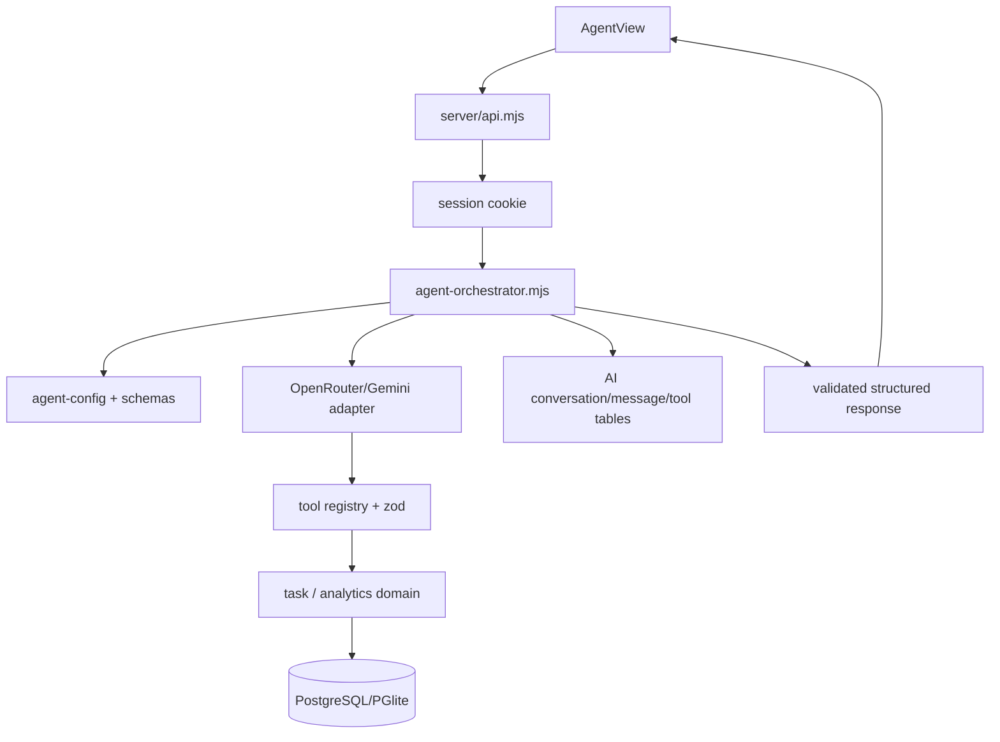

# Agent Integration Design

**Spec**: `.specs/features/agent-integration/spec.md`
**Status**: Draft

## Architecture Overview

O Agent será um vertical slice nativo do TARGET. A rota HTTP valida sessão e envelope; o orchestrator monta contexto mínimo, chama um adapter server-side, valida Tool Calls e Structured Output, persiste conversa e auditoria e retorna um contrato seguro ao `AgentView`.

## Code Reuse Analysis

| Existing component | Location | Use |
| --- | --- | --- |
| HTTP router, origin checks and public errors | `server/api.mjs` | Integrar a rota sem criar segundo servidor. |
| Session lookup | `server/api.mjs`, `server/security.mjs` | Derivar identidade do cookie HttpOnly. |
| Snapshot/task persistence | `server/data.mjs` | Reutilizar entidades, enums, histórico e ownership. |
| Authorized analytics pipeline | `server/analytics.mjs`, `analytics/prepare.py` | Evitar SQL/Prisma paralelo para métricas. |
| SQL runtime | `server/database.mjs`, `database/*.sql` | Compatibilidade PostgreSQL/PGlite. |
| Agent visual shell | `components/edutrack/views.tsx` | Trocar somente a prévia por componente real. |
| Validation dependency | `zod` em `package.json` | Schemas estritos sem pacote novo. |

## Components and Interfaces

| Component | Location | Interface |
| --- | --- | --- |
| Config | `server/agent-config.mjs` | `readAgentConfig(env)` retorna provider, modelos, timeout e limites. |
| Schemas | `server/agent-schemas.mjs` | Schemas zod para envelope, Tools, mensagens, output e gráfico. |
| Provider | `server/agent-provider.mjs` | `createAgentProvider(config, transport)` com `complete(messages, tools)`. |
| Tools | `server/agent-tools.mjs` | Registry allowlisted e `executeTool(name,args,context)`. |
| Orchestrator | `server/agent-orchestrator.mjs` | `chatWithAgent({db,user,message,conversationId,config,provider})`. |
| HTTP boundary | `server/api.mjs` | `POST /api/ai/chat`, sessão, envelope e status públicos. |
| Frontend client | `components/edutrack/agent-api.ts` | `chatWithAgent(input)` same-origin. |
| Frontend view | `components/edutrack/agent-view.tsx` | chat, loading, erro, mensagens e output estruturado. |
| Chart renderer | `components/edutrack/agent-chart.tsx` | Recharts a partir de `ChartSpecification` sem código executável. |

## Data Models

As tabelas existentes `ai_conversations`, `ai_messages` e `ai_tool_executions` serão reutilizadas. Todas as consultas incluem `user_id` da sessão. `academic_tasks.agent_execution_id` referencia o `executionId` da Tool de criação. Uma migração opcional idempotente adiciona índices `(user_id, updated_at)` e `(conversation_id, created_at)` se o schema atual ainda não os possuir.

O audit registra `executionId`, `userId`, `conversationId`, `toolName`, input/output redigidos, status, modelo, versão do prompt e timestamps. Nenhum token, password, API key ou JWT entra em input/output persistido.

## Provider and Context

- OpenRouter usa endpoint configurável, headers server-side, modelo primário, uma tentativa transitória e fallback limitado.
- Gemini traduz mensagens e Tool declarations para o formato do endpoint configurado, com o mesmo timeout e retry finito.
- O transporte é injetável para testar sem rede; o frontend nunca chama o Provider.
- O contexto contém system prompt versionado, data local, mensagem atual, histórico limitado, lista de disciplinas próprias e Tool results.
- O loop encerra ao receber resposta final ou atingir três iterações.

## Security and Error Handling

- A sessão do TARGET é a única fonte da identidade; `userId` em argumentos é rejeitado.
- Registry desconhecido, schema inválido, UUID malformado, enum inválido e campos extras são rejeitados antes do domínio.
- Conversation e task queries filtram `user_id`; falha de ownership não revela existência.
- Erros públicos usam `401`, `400`, `403`, `404`, `429`, `503` ou `504` conforme a causa; detalhes ficam em log server-side.
- Prompt injection nunca amplia o registry e nunca expõe o prompt, secrets, SQL ou código.

## Risks & Concerns

| Concern | Mitigation |
| --- | --- |
| `views.tsx` é grande e concentra várias views | Criar arquivos Agent separados e alterar somente o export/import necessário. |
| PGlite e PostgreSQL podem divergir em SQL | Usar placeholders e sintaxe já suportada pelo adaptador; cobrir banco em memória. |
| LLM pode retornar argumentos malformados | Parse e `zod.strict()` antes de qualquer função de domínio. |
| Lint tem falhas anteriores em arquivos não relacionados | Registrar baseline e comparar erros introduzidos sem corrigir escopo alheio. |
| Não há E2E dedicado | Cobrir API com `createServer` e banco `memory://`; registrar E2E real como deferred. |

## Migration Plan

1. Adicionar migração SQL idempotente de índices e registrá-la em `openDatabase`.
2. Implementar módulos server-side e testes mockados/in-memory.
3. Integrar rota e UI.
4. Atualizar `.env.example`, docs, TLC e OpenSpec.
5. Rodar gates e smoke tests; rollback remove apenas arquivos do change e os índices.

## Open Questions

Nenhuma pergunta que altere o escopo permanece aberta. Rate limiting distribuído, streaming, RAG, filas e E2E dedicado estão explicitamente deferred.
