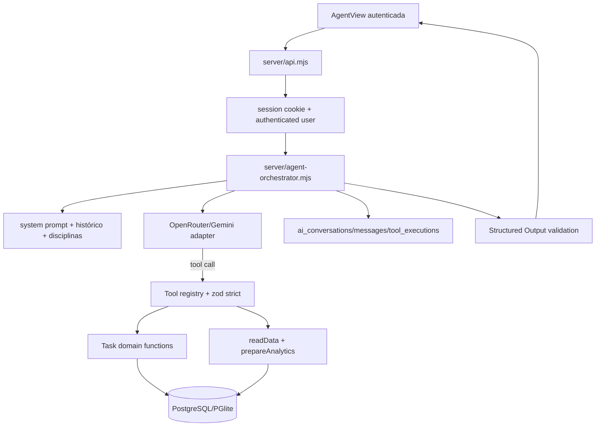

# Design

## Context

O TARGET usa `server/api.mjs` como API Node HTTP, `server/database.mjs` como adaptador de PostgreSQL/PGlite, SQL versionado em `database/`, autenticação por cookie HttpOnly e validação com `zod`. O `db/schema.ts` está vazio e o Drizzle configurado no repositório não participa do caminho de runtime; portanto o Agent usará o adaptador SQL já existente, sem introduzir uma segunda camada ORM. `AgentView` vive em `components/edutrack/views.tsx` e atualmente é apenas uma prévia.

O SOURCE foi auditado somente como referência: possui Agent Controller, Orchestrator, Tool Registry/Validator, adapters OpenRouter/Gemini, schemas `text/analysis/action/chart`, tabelas AI e uma UI de chat. Nenhuma abstração NestJS, Prisma, JWT, migration ou página inteira do SOURCE será transportada.

## Goals / Non-Goals

**Goals:**

- Entregar um vertical slice autenticado de chat, Tool Calling, persistência e UI.
- Reutilizar a sessão, banco, tarefas e analytics do TARGET.
- Manter validação server-side, ownership por `user_id`, auditoria redigida e resposta estruturada.
- Permitir Provider mockado em testes sem rede real.

**Non-Goals:**

- Não substituir Next/Vinext/React, Node HTTP, PostgreSQL/PGlite ou o mecanismo de sessão.
- Não adicionar Prisma, NestJS, Drizzle runtime, SDK de Provider ou dependência de JSON Schema.
- Não implementar RAG/memória semântica, streaming, Google Classroom, push, filas ou rate limiting distribuído.
- Não tornar o modo demonstração um canal para dados locais chegarem ao LLM.

## Decisions

### 1. Módulos server-side nativos

Criar módulos `.mjs` em `server/` para configuração, schemas, Provider, Tools, orchestrator e analytics. `server/api.mjs` apenas autentica, valida o envelope HTTP e delega ao orchestrator.

### 2. `zod` como validação do TARGET

Usar `zod` existente para schemas de Tools e Structured Output. Os mesmos contratos exportam objetos JSON Schema para OpenRouter/Gemini, evitando adicionar Ajv quando o TARGET já possui validação estruturada.

### 3. Domain service de tarefas

Criar funções pequenas de domínio para as Tools sobre o mesmo banco e as mesmas tabelas de `data.mjs`. Elas aplicam ownership, enums, histórico e `created_by=AGENT`; não criam uma tabela ou regra paralela.

### 4. Analytics por pipeline existente

As Tools de analytics chamam `readData` e `prepareAnalytics`, que já filtram o usuário e removem dados desnecessários antes do Python. O Agent não receberá SQL nem acesso direto ao banco fora das funções de domínio.

### 5. Provider com transporte injetável

OpenRouter implementa API Chat Completions compatível, retry único por modelo e fallback. Gemini preserva o adapter funcional do SOURCE com conversão de mensagens/Tools e retry limitado. O transporte será injetável nos testes.

### 6. Contexto mínimo

O prompt contém instruções, data no timezone do usuário, mensagem atual, histórico limitado da conversa e lista autorizada de disciplinas `{id,name}` para permitir `create_task`. Não inclui senha, token, API key, SQL ou dados de outra conta.

### 7. Contratos estruturados

`text`, `analysis` e `action` terão contratos v1. `ChartSpecification` aceita somente tipos, eixos, séries, dados e fontes de analytics registradas no TARGET. A UI recebe apenas o resultado depois da validação backend.

### 8. Rate limit e modo demo

O TARGET não possui requisito operacional de rate limit para Agent nem limitador compartilhado. O change registra rate limiting distribuído como deferred. A rota continua protegida por sessão/origem e o modo demo permanece offline.

## Architecture

## Components

| Componente | Localização | Responsabilidade |
| ---------- | ----------- | --------------- |
| Configuração/contratos | `server/agent-config.mjs`, `server/agent-schemas.mjs` | Env server-side, JSON Schema v1 e validação zod |
| Provider adapter | `server/agent-provider.mjs` | Transporte fetch, OpenRouter/Gemini, retry, fallback, timeout |
| Registry/Tools | `server/agent-tools.mjs` | Schemas, validação, tarefas, analytics e ownership |
| Orchestrator | `server/agent-orchestrator.mjs` | Conversa, contexto, loop, persistência, audit e resposta |
| HTTP boundary | `server/api.mjs` | Sessão, envelope, códigos públicos e delegação |
| Frontend API | `components/edutrack/agent-api.ts` | Cliente same-origin e tipos da resposta |
| Frontend view | `components/edutrack/agent-view.tsx` | Chat, loading, errors, structured output e contexto |
| Chart renderer | `components/edutrack/agent-chart.tsx` | Renderização segura de specs validadas |

## Data Models

As tabelas existentes `ai_conversations`, `ai_messages` e `ai_tool_executions` são reutilizadas. `academic_tasks.agent_execution_id` mantém a relação para tarefas criadas por Agent. Uma migração incremental adiciona os índices compostos `ai_conversations(user_id, updated_at)` e `ai_messages(conversation_id, created_at)` se ainda não existirem.

## Error Handling Strategy

| Cenário | API | UI |
| ------- | --- | -- |
| Sem sessão/conversa não autorizada | `401/404`, sem detalhes | Solicita login ou mostra acesso não permitido |
| Quota/provider indisponível | `429/503` com código seguro | Orienta tentar mais tarde |
| Timeout | `504` | Informa tempo excedido |
| Tool/schema inválido | `400` ou resposta controlada após audit | Informa que a ação não foi executada |
| Banco/analytics/schema | `500/503`, log server-side | Mensagem genérica |

## Risks / Trade-offs

| Risco | Mitigação |
| ---- | --------- |
| `views.tsx` é um arquivo grande e comprimido | Criar `agent-view.tsx` e trocar apenas o export de `AgentView`. |
| PGlite e PostgreSQL podem divergir em detalhes SQL | Usar SQL já aceito pelo `openDatabase` e cobrir o caminho em testes de memória. |
| Provider retorna argumentos JSON inválidos | Marcar argumentos inválidos antes do validator, evitando que `{}` execute Analytics. |
| Prompt injection tenta obter segredo | Não incluir secrets no contexto; registry estrito e backend como autoridade. |
| Lint possui cinco erros anteriores | Registrar baseline e não alterar arquivos não relacionados; validar que a integração não adiciona erros. |
| `db/schema.ts` não representa o SQL real | Não usar Drizzle para o Agent; documentar SQL/migrations como fonte runtime. |

## Migration Plan

1. Aplicar migração de índices via o mecanismo existente de `schema_migrations`.
2. Configurar somente variáveis server-side no `.env.local`; atualizar `.env.example` sem valores reais.
3. Rodar testes mockados e de banco em memória.
4. Em rollback, remover os módulos/rota/UI do change; a migração contém apenas índices e não altera dados.

## Open Questions

Nenhuma pergunta que altere o escopo ficou aberta. Rate limiting distribuído, streaming, E2E dedicado e memória avançada estão explicitamente deferred.
